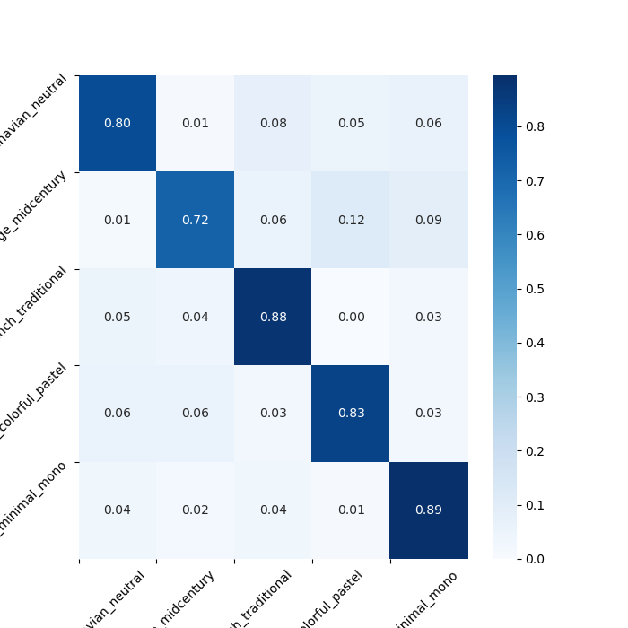

# Room_style_Classifier
> N개의 class로 구성된 room scene image dataset을 이용하여 
>
> 인테리어 style class를 예측하는 모델

```
- data_preperation.py
- training_classifier.py
- analysis_results.py
```

# Dataset structure
* dataset : private files at Pinterest images
```
* dataset_image_pinterest_ver2/
    ├─ retro_vintage_midcentury
    　　├─ 1.jpg
    　　└─ 2.jpg
    ├─ classic_french_traditional
    ├─ casual_colorful_pastel
    ├─ modern_urban_minimal_mono
    └─ natural_scandinavian_neutral
```
# Implement flow
> `main.py` 참조
> ### 1. Data preperation
> > data를 입력 받아 pipeline을 생성하고,
> >
> > label을 mapping한 후,
> >
> > train/validtaion/test의 비율로 slicing한 후,
> >
> > prefetching
> > ```
> > dataset = Data_preperation()
> > dataset.data_pipeline(data_dir)
> >
> > #checking process
> > dataset.print_class_list()
> > dataset.checking_data() #with GUI
> > 
> > dataset.mapping_dataset()
> > dataset.slicing_dataset(train=0.6, val=0.15, test=0.25)
> >
> > #checking process
> > dataset.checking_slicing_balance() #with GUI
> >
> > dataset.prefetching_dataset()
> > ```
> > `data_dir`에 file path 전달
> >
> > `data_dir = "dataset_image_pinterest_ver2"`
> > ```
> > * OUTPUT
> >     - class_list
> >     - train_ds
> >     - val_ds
> >     - test_ds
> >     - [Data_preperation]checking_data.png
> >     - [Data_preperation]checking_slicing_balance.png
> > ```
>
> ### 2. Training
> > dataset의 layer를 생성 후, 학습 및 test
> > ```
> > classifier = Classifier()
> > classifier.aug_layer()
> > # option # : 0 CNN / 1 VGG-16 / 2 ResNet-50 / 3 EfficientNet-B0
> > classifier.layers(len(class_list),option=3)
> > 
> > classifier.training(train_ds, val_ds, epochs)
> > classifier.accuracy_loss_graph() #with GUI
> > 
> > classifier.testing(test_ds)
> > ```
> > `train_ds`, `val_ds`, `epoch` 전달
> > ```
> > * OUTPUT
> >     - model
> >     -[Classifier]accuracy_loss_graph.png
> > ```
> ### 3. Analysis results
> > sample random data에 대하여 시각적으로 정확도를 비교하거나,(`show_predictions`)
> > confushion matrix를 통해 class별 정확도를 확인하거나, (`show_confusion_matrix`)
> > txt파일로 결과를 받아 각 data의 class 예측 확률을 확인할 수 있다. (`saving_results`)
> > 또한, top-1 및 top-2 class 정확도를 출력해 확인할 수 있다. (`top_acc`)
> > ```
> > analysis = Analysis_results(class_list, model)
> > 
> > analysis.show_predictions(test_ds,"test_dataset") #with GUI
> > analysis.show_confusion_matrix(test_ds,"test_dataset") #with GUI
> > analysis.saving_results(test_ds,"test_dataset")
> > analysis.top_acc(test_ds)
> > ```
> > `class_list`, `model` 전달
> > ```
> > * OUTPUT
> >     - [Analysis_results]show_predictions_[dataset].png
> >     - [Analysis_results]show_confusion_matrix_[dataset].png
> >     - [dataset]_class_accuracy.txt
> >     - result_img/
> >     - false_img/
> > ```


# OUTPUT
> ### - confusion matrix
> > 
> > 
> > 실제 class를 model이 어떻게 예측했는지 확인할 수 있다.
> >
> > 대각선으로 나타나는 부분이 올바른 class로 예측한 것이고, (`TP`)
> >
> > 그 외는 잘못 예측한 부분이다. (`TN`)
> > 
> ### - [dataset]_class_accuracy.txt
> > 각 data 당  model이 어떤 class를 어떤 확률로 예측했는지
> >
> > 결과를 나타낸 파일이다.
> >
> > random하게 섞인 결과 data는 `result_img`에 순서대로 확인할 수 있다.
> ### - result_img/
> ### - false_img/
> > 잘못 예측한 결과 data에 대해 확인할 수 있다.
